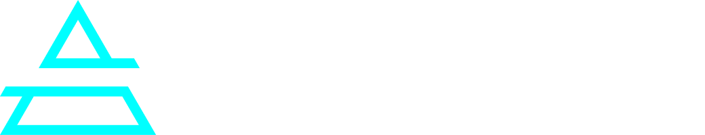

<!-- jump_to_middle -->



<!-- alignment: center -->

---

# Win a Hackathon with AI Agents

_Build agents that work and win_


<!-- reset_layout -->

<!-- end_slide -->

Win a Hackathon with AI Agents
---

**What we'll cover:**

1. **Why agents?** The future of software
2. **What is an agent?** High-level → technical anatomy
3. **Live demo:** ArXiv Paper Hackathon Scout agent in action
4. **Deep dive:** Tools, loops, and non-determinism
5. **Deploy live:** Local → cloud in 60 seconds
6. **Patterns that win:** How to build hackathon-worthy projects
7. **Pitch:** The 90-second demo script that wins


**You'll walk away with:**
* Understanding the basics of an agent
* A deployable agent template
* Winning hackathon patterns
* Free Agentuity credits

<!-- end_slide -->

Agentic software is the future
---

> Most applications will have some form of agent, that's why we've started saying "agentic software" over just "agents"


Agents unlock the non-deterministic use cases in the world that are oftentimes hard to build against in software engineering.

<!-- end_slide -->

Let's See One Work
---

# **ArXiv Paper Hackathon Scout Agent**

_A simple research agent that looks up ArXiv papers and comes up with hackathon ideas from them._

**What you'll see:**
* Real-time streaming response
* Tool calls to ArXiv API
* Paper classification (ML/AI/CV)
* Hackathon project ideas generated

---

[](https://github.com/agentuity/cmu-workshop-2025)

```bash
# Run it yourself:
git clone https://github.com/agentuity/cmu-workshop-2025.git
agentuity project import
agentuity dev
```

<!-- end_slide -->


What is an Agent? (High Level)
---

**Simple definition:**

> An agent is software, coupled with an LLM, that has some semblance of autonomy.
<!-- pause -->

**Not an agent:**
* A chatbot that just responds with 100% deterministic output (old school NLP)
* A script that runs in a for loop, with no LLM calls
* A static API endpoint

<!-- pause -->

**IS an agent:**
* Software that uses an LLM which calls tools based on context
* LLM loops until the goal is met or budget runs out
* Makes decisions based on observations
* i.e. _It has some form of agency_

--- 

_**Example:** "Find me 3 papers on diffusion models and suggest project ideas"
→ Agent searches ArXiv → classifies results → generates ideas → stops when complete_

<!-- end_slide -->

What is an Agent? (Technical Anatomy)
---

**Core components:**

```
                    ┌──────────────┐
        ┌───────────┤   Goal/Task  │
        │           └──────────────┘
        ▼
   ┌─────────┐      ┌──────────┐      ┌──────────┐
   │   LLM   │─────▶│  Tools   │─────▶│  Results │
   │  calls  │      │  (APIs)  │      │& analysis│
   └─────────┘      └──────────┘      └──────────┘
        ▲                                   │
        │           ┌──────────┐            │
        └───────────┤   Loop   │◀───────────┘
                    │  Control │
                    └──────────┘
                 (Repeat until done)
```

<!-- pause -->

1. **LLM Calls** - OpenAI, Claude, Gemini, etc
2. **Tools** - Functions the agent can call (API, search, grep)
3. **Memory** - Conversation history + state
4. **Controller** - Loop logic, stop conditions, step budget
5. **Eval** - Tests to ensure quality

<!-- pause -->

**In our ArXiv agent:**
* LLM: Claude Sonnet 4.5
* Tool: `searchArxiv()` via Groq for parsing
* Memory: Chat history (using a KV store)
* Loop control: Max 3 steps
* Eval: (well we're just going to test manually)

<!-- end_slide -->

Technical Deep Dive: Tools
---

**Tools are just functions the LLM can call**

```typescript
const searchArxiv = tool({
  description: "Search ARXIV for research papers",
  inputSchema: z.object({
    query: z.string(),
    maxResults: z.number().default(5),
  }),
  execute: async ({ query, maxResults }) => {
    // Fetch XML from ArXiv API
    // Parse with Groq (fast!)
    // Return structured data
  },
});
```

<!-- end_slide -->

Technical Deep Dive: The Loop
---

**Agents loop until done**

```typescript
const result = await generateText({
  model: anthropic("claude-sonnet-4-5"),
  stopWhen: stepCountIs(3),  // ← Stop condition
  system: "Your system prompt here...",
  prompt: userRequest,
  tools: { searchArxiv },
});
```

**Plan → Act → Observe → Repeat**

1. LLM reads the goal
2. Decides which tool to call (or finish)
3. Tool executes → returns observation
4. LLM sees observation → decides next action
5. Repeat until goal met or max steps reached

**Why stop conditions matter:**
* Prevent infinite loops
* Control costs
* Make the end predictable

<!-- end_slide -->

Deploy Live: Agentuity
---

**Local → Cloud in 2 minutes**

```bash
# Authenticate
agentuity login

# Deploy
agentuity deploy
```


**What you get:**

```
 [Webhook ]─┐          ┌─[   Agent]
 [Cron    ]─┤  ╔════╗  ├─[ Discord]
 [SMS     ]─┼── Agent──┼─[Telegram]
 [API     ]─┤  ╚════╝  ├─[   Slack]
 [Discord ]─┘          └─[     SMS]
```

* Public HTTPS endpoint • Streaming support
* Give your agent an email address
* Secrets management • Live logs • Auto-scaling
* No need to sign up for multiple providers with the _AI Gateway_
* Easy and secure agent handoff
* Monitoring, observability, and insights

<!-- end_slide -->

Building Projects That Win
---

# **Pattern 1: Pick a wedge, not the world**

<!-- pause -->

❌ **Don't:** "Build AGI that does everything"

✅ **Do:** "Agent that finds 3 relevant papers and suggests 1 project idea"

_✅ **Caveat:** Briefly pitch the larger scale benefits (just don't overdo it in your solution)_

<!-- pause -->

**Why this wins:**
* You can demo it quickly
* It actually works
* Judges understand it immediately
* It's sophisticated enough to understand the larger benefits

<!-- pause -->

# **Pattern 2: Build for demo-first**

* Lock in ONE main journey
* You should be able to demo it blindfolded
* Multiple example inputs/outputs are good (i.e. did you hard code this or does it actually work?)

<!-- end_slide -->

Building Projects That Win (cont.)
---

# **Pattern 3: Show your work**

_Code snippets, architecture overview, tech stack matter_

Just don't overdo the details.

---

**Why it matters:**
* Remember most the time judges won't review all the amazing work you did during the hackathon.
* Proves your code is real, thought out, has meaning
* Shows you thought about quality
* Demonstrates tech maturity
* Makes judges trust your demo

<!-- pause -->

# **Pattern 4: Use real constraints**

* Real APIs
* Real data
* Real hardware
* Real integrations

Judges notice when it's not a toy.

<!-- end_slide -->

Building Projects That Win (cont.)
---

**Things judges notice:**

1. **Unique data or hardware**
2. **Real constraints** - Solves an actual problem, not a hypothetical
3. **Live integration** - Works with real systems NOW
4. **Measurable impact** - "Saves 2 hours/week" not "improves productivity"
5. **90-second narrative** - Can explain + demo in one breath
6. Briefly address what could be next

# **Anti-patterns to avoid:**

* Too big of a sky ("it does everything")
* Flaky demos ("It worked an hour ago")
* Slow models (Don't kill your demo because the research assistant takes 15 minutes, if it does, have a pre-run of it with results ready)
* No fallbacks (what if API is down?)

<!-- end_slide -->

Scope Ruthlessly
---

**Time budget for hackathons:**

* **65% on the demo path** - One working journey, bulletproof
* **25% on polish** - UI, UX, use case and narrative, etc.
* **10% on stretch goals** - Only if demo is perfect

**Deploy early:**
* Figure out how it's going to run, ASAP
* If others can run it (i.e. you deployed it), even better
* Show judges you can ship


> The team that deploys first often wins

<!-- end_slide -->

Recap: Your Playbook
---

**What you learned:**

1. ✅ Agentic software
2. ✅ Tools + LLM + loop = agent
3. ✅ Deploy with Agentuity in 2 minutes
4. ✅ Pick a wedge, build demo-first, show your work

**What you're taking home:**
* ArXiv Paper Scout agent (deployable template)
* Free Agentuity credits
* Patterns that win
* Access to our team at the sponsor table

<!-- end_slide -->


Let's Build Something Amazing
---

---

# **Come to the Agentuity table:**
* Get help with your agent
* Free credits for participants
* Code reviews

# **Resources:**

_Sign up: https://agentuity.com_

Template repo: `https://github.com/agentuity/cmu-workshop-2025`


Docs: `https://agentuity.dev`


Discord: `discord.gg/agentuity`

---


**Good luck!**

<!-- end_slide -->
